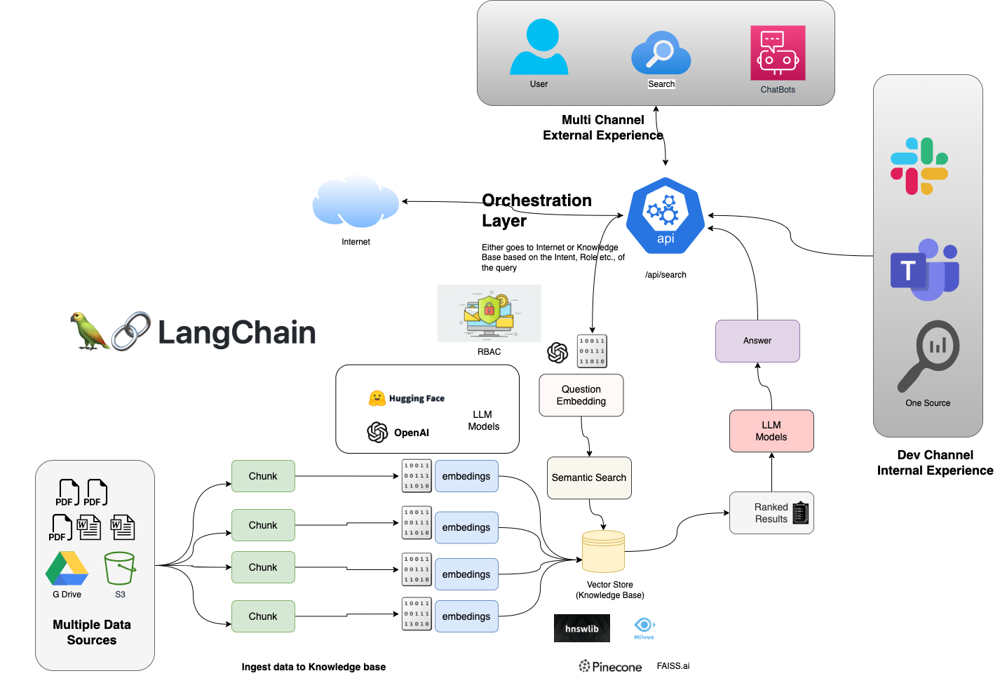

# AI Optima Search in Knowlege base

## Why?
> what is the business value?

AI Optima search in a knowledge base enables efficient retrieval of relevant information, improves search accuracy, enhances data exploration, and aids in personalized recommendations, leading to effective knowledge discovery and improved decision-making.

## What does this application do?
This is a Python application that allows you to ask any questions, which uses a LLM to generate a response by finding the intent of the request and search in various sources like existing knowledge base, internet etc., based on the intent and applies RBAC before showing the right response to authorized user.

## What are the components of the Application?

Role-Based Access Control (RBAC):

1. Manages user permissions and access levels based on their roles.
2. Ensures secure and controlled access to the application's features and data.
3. Enables administrators to define and assign roles to users, granting appropriate privileges.

Similarity Search:

1. Allows users to find relevant information based on similarity rather than exact matches.
2. Enables exploration and analysis of large datasets by identifying patterns and relationships.
3. Enhances search engines, recommender systems, and content-based filtering for personalized results.

Search Based on Intent:

1. Employs natural language processing techniques to understand user intent.
2. Enhances search functionality by providing relevant results based on user queries and context.
3. Improves user experience by delivering accurate and targeted information.

Knowledge Discovery:

1. Facilitates efficient retrieval of relevant information from a knowledge base.
2. Enables users to explore and extract valuable insights from large and diverse datasets.
3. Enhances decision-making by uncovering hidden patterns, similarities, and relationships.

Personalized Recommendations:

1. Utilizes similarity search to suggest relevant items based on user preferences or behaviors.
2. Enhances user experience by providing personalized and targeted recommendations.
3. Increases engagement and satisfaction by matching user interests with suitable content.

By incorporating RBAC, similarity search, and search based on intent, the application ensures secure access, efficient retrieval, personalized recommendations, and effective knowledge discovery for users.

## What is the Architecture looks like?

Here is the overall solution:



This Solution has two perspetvies

* **Storage Perspective:** (from left to right) The solution collects information from diverse sources, converts it into numerical embeddings, and stores them in a vector store, allowing efficient storage and retrieval of data.

* **Search Perspective:** (from top to bottom) The solution employs intent-based search algorithms, utilizing natural language processing techniques, to match user queries with vector representations in the store, providing accurate and relevant results from both internal and internet sources, which improves external user experiance and internal/developer experinaces 

## How does it works

The application works by reading information (PDF, Docs, text files, audio, videos etc.,), converting them into manageable chunks, applying embeddings (numeric representations) to the chunks using LLMs, storing them in a vector store, and utilizing similarity search techniques to retrieve relevant information based on similarities between chunks, enabling efficient knowledge retrieval and exploration.

The application uses Streamlit to create the GUI and Langchain to deal with the LLM.

## Capabilities that can be achieved
### Impersonation
One of the most important ability of LLM are they can be configured to act in any desired way. It can be configured in following way
* It can be asked to a HR person, Business Analyst or any role
* Role of Chatbot can be determined based on RBAC i.e. for employees it can act like an HR person and give answers related to company policies but for CEO it can act like Acconts Managers and give information related to it
* Responses can also be fully customized based on role of ChatBot and its attitude and tone can also be configured as desired


### Fetching Information
* Chatbot can be equiped with unlimited tools at it disposbale which can be used to fetch any relevant data. It can a web search (Google, DuckDuckGo), any web page, documents or even API and than represent it to user in a friendly description
* It can also be used to summarise long documents and it can be even filtered based on natural lagunage or context of the obvservation
* You can also interact with document and it can be asked to elaborate even more
* It is also capable of reading .csv or .xls files to come up 
* It can also be equiped with 3rd party APIs to fetch the relavent data and based on response it can come up with conclusion of choose another tool get even more information
* It can be configured to traslate responses into any desired language

### Intent / Sentiment Analysis
* It can be configured to detect the intent of end user and serve/restrict the reponses based on information provided
* It can also be used to identify customer satisfaction or sentiments during the conservation. And we can also perform a specific action based on sentiments i.e. if customer is not satified with the service, have a problem very frequent or he is just angry for some reason we can report it along with the entire conservation to relevant team or take specific action
* ChatBot can also be configured to take any action on behalf of other teams

### Natural Conservation
* Chatbot can be configured to strictly chat/conserve related to specific topic i.e. HR policy only, or it can be configured to chat related multiple topics ot context. 
* Chatbot can also be configured to give general purpose questions i.e. what is the size of milkyway galaxy. Or even basi logic or maths realated problems 
* Unlike other assistance it always has the context of the conservation so it knows that user/customer is asking for in a natural ways without using any specif commands

## Task Completion
* It can be configured to carry out any specific task i.e. you can give a topic and ask it to write terms and conditions or you can give it a topic for content it can come up with a catchy title and also write content/script for you. And also bring up facts about it


## Installation

To install the repository, please clone this repository and install the requirements:

```
docker-compose build
```

You will also need to add your OpenAI API key to the `.env` file.

## Usage

To use the application, run the `docker-compose up` : 

```
docker-compose up
```

invoke `localhost:8501` to access the application

### Current Capabilities
* Currently user can only upload multiple .docx or .pdfs files
* Everytime you upload a file it will create new indexing/embeddings which are stored at instance level using FAISS (open source vector store provided by Facebook)
* Refreshing the page will destroy previous context
* RBAC is only limited to **'admin'** and other users. Only user with role **admin** have access to **Financial/Accounts** information. Other users have access to Company Policy and Gerenal Purpose question or logic which is gathered over the internet
* There might me some occasional loss of context which we are improving. In that case you will be still able to ask any question but response will not appear as a chat format
* Longer conservation will increase chat tokkens as we have not implemented any cap with max chat limit

### Roadmap
* Integrate with https://github.com/microsoft/guidance to control modern language models more effectively and efficiently than traditional prompting or chaining.
* Add a .csv/.xls reader to perform analysis on sheet and answer relevant queries
* Perform data validation and error handling to ensure accurate analysis and reliable query responses
* Add support to Google Cloud, AWS S3 bucket, Azure storage to fetch revelant files for Q/A
* A web scrapper or webpage loader to convert it content to plain string and perform analysis on it
* Implement a clould storage to store embeddings of documents for faster reterival of indexed data for similarity search purpose
* Implement Open Source embeddings model i.e. Instruct to create better embedding for free
* Dynamic RBAC or Claim Based access
* Implement Custom Tools and Agents for even more control over the response
* Implement Dynamic Custom Agent based on Access Level to only expose relevent document/services
* Custom output parser to return most relvent information in concise manner
* Implment different summarization techniques for conversation context so save tokens and get quicker response from LLM
* Develop adapters or connectors for seamless integration with different platforms.
* Enable user suggestions for adding new questions and answers to the knowledge base, with a review and approval process
* Session / Cache management over API
* Set up a CI/CD pipeline for automated testing, version control, and deployment of updates to ensure a smooth and agile development process.
* Integrate automated testing frameworks to validate the chatbot's functionality and performance.
* Use machine translation models or translation APIs to provide language flexibility to users.
* Develop connectors or API integrations to interact with external systems and fetch relevant data from third-party tools or services
* Implement Addons or Chatbot extension for Slack or Teams so anyone within the organisation have direct access to all of the services provided
* Integrate logging and monitoring capabilities to track user interactions, identify bottlenecks, and collect insights for further improvements.
* Utilize analytics tools to measure user satisfaction, engagement, and overall performance of the chatbot
* Implement robust error handling mechanisms to gracefully handle unexpected user inputs or system failures
* Develop fallback strategies to provide informative and helpful responses when the chatbot encounters queries it

## Contributing

TBD

